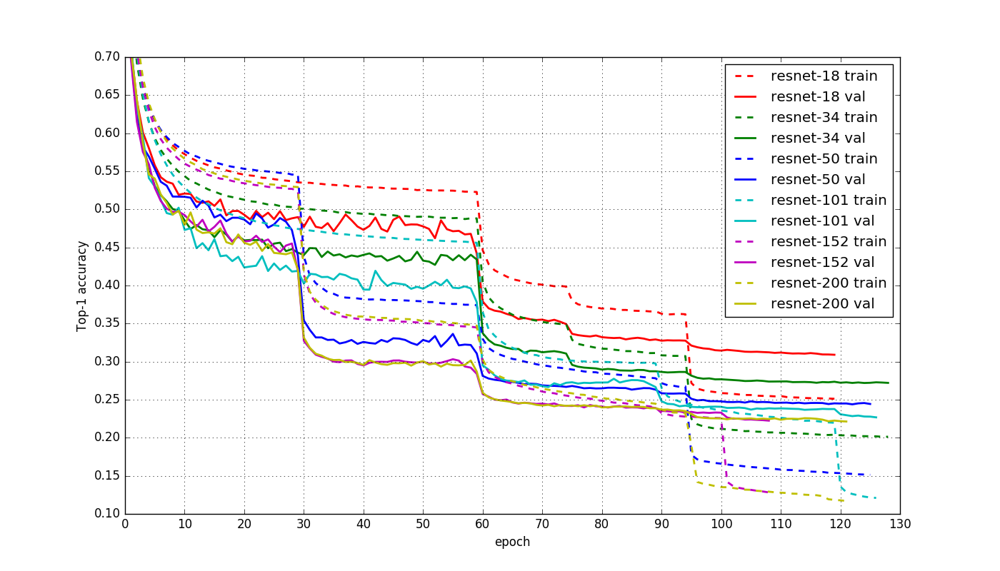

Reproduce ResNet-v2 using MXNet
=====================================
## Requirements
- Install [MXNet](http://mxnet.readthedocs.io/en/latest/how_to/build.html) on a machine with CUDA GPU, and it's better also installed with [cuDNN v5](https://developer.nvidia.com/cudnn)
- Please fix the randomness if you want to train your own model and using this [pull request](https://github.com/dmlc/mxnet/pull/3001/files)

## Trained models

The trained ResNet models achieve better error rates than the [original ResNet-v1 models](https://github.com/KaimingHe/deep-residual-networks).

### ImageNet 1K

Imagenet 1000 class dataset with 1.2 million images.

single center crop (224x224) validation error rate(%)

| Network       | Top-1 error | Top-5 error | Traind Model |
| :------------ | :---------: | :---------: | :-------------: |
| ResNet-18     | 30.48       | 10.92       |[data.dmlc.ml](http://data.dmlc.ml/mxnet/models/imagenet/resnet/18-layers/) |
| ResNet-34     | 27.20      | 8.86        | [data.dmlc.ml](http://data.dmlc.ml/mxnet/models/imagenet/resnet/34-layers/) |
| ResNet-50     | 24.39   | 7.24   | [data.dmlc.ml](http://data.dmlc.ml/mxnet/models/imagenet/resnet/50-layers/) |
| ResNet-101    | 22.68      | 6.58        | [data.dmlc.ml](http://data.dmlc.ml/mxnet/models/imagenet/resnet/101-layers/) |
| ResNet-152    | 22.25       | 6.42        | [data.dmlc.ml](http://data.dmlc.ml/mxnet/models/imagenet/resnet/152-layers/) |
| ResNet-200    | 22.14       | 6.16        | [data.dmlc.ml](http://data.dmlc.ml/mxnet/models/imagenet/resnet/200-layers/) |

### ImageNet 11K:

 Full imagenet dataset: `fall11_whole.tar` from
 http://www.image-net.org/download-images.

 We removed classes with less than 500 images. The filtered dataset contains
 11221 classes and 12.4 millions images. We randomly pick 50 images from each
 class as the validation set. The split is available at http://data.dmlc.ml/mxnet/models/imagenet-11k/

| Network       | Top-1 error | Top-5 error | Traind Model |
| :------------ | :---------: | :---------: | :-------------: |
| ResNet-200 | 58.4 | 28.8 |  |


### cifar10: single crop validation error rate(%):

| Network    | top-1 |
| :------:   | :---: |
| ResNet-164  | 4.68 |

### Training Curve
The following curve is ResNet-v2 trainined on imagenet-1k, all the training detail you can found [here](./log), which include gpu information, lr schedular, batch-size etc, and you can also see the training speed with the corresponding logs.   

<div align="left">
  
</div>

you can get the curve by run:  
```cd log && python  plot_curve.py --logs=resnet-18.log,resnet-34.log,resnet-50.log,resnet-101.log,resnet-152.log,resnet-200.log```

## How to Train

### imagenet
first you should prepare the `train.lst` and `val.lst`, you can generate this list files by yourself(please ref.[make-the-image-list]( http://mxnet.readthedocs.io/en/latest/packages/python/io.html#make-the-image-list), and do not forget to shuffle the list files!), or just download the provided version from [here](http://data.dmlc.ml/mxnet/models/imagenet/resnet/).

then you can create the ```*.rec``` file, i recommend use this cmd parameters:
```shell
$im2rec_path train.lst train/ data/imagenet/train_480_q90.rec resize=480 quality=90
```
set ```resize=480``` and ```quality=90```(```quality=100``` will be best i think:)) here may use more disk memory(about ~103G), but this is very useful with scale augmentation during training[1][2], and can help reproducing a good result.

because you are training imagenet , so we should set ```data-type = imagenet```, then the training cmd is like this(here i use 6 gpus for training):
```shell
python -u train_resnet.py --data-dir data/imagenet \
--data-type imagenet --depth 50 --batch-size 256  --gpus=0,1,2,3,4,5
```
change depth to different number to support different model, currently support ResNet-18, ResNet-34, ResNet-50, ResNet-101, ResNet-152, ResNet-200.

### cifar10
same as above, first you should use ```im2rec``` to create the .rec file, then training with cmd like this:
```shell
python -u train_resnet.py --data-dir data/cifar10 --data-type cifar10 \
  --depth 164 --batch-size 128 --num-examples 50000 --gpus=0,1
```
change ```depth``` when training different model, only support```(depth-2)%9==0```, such as RestNet-110, ResNet-164, ResNet-1001...

### retrain
When training large dataset(like imagenet), it's better for us to change learning rate manually, or the training is killed by some other reasons, so retrain is very important.
the code here support retrain, suppose you want to retrain your resnet-50 model from epoch 70 and want to change lr=0.0005, wd=0.001, batch-size=256 using 8gpu, then you can try this cmd:
```shell
python -u train_resnet.py --data-dir data/imagenet --data-type imagenet --depth 50 --batch-size 256 \
--gpus=0,1,2,3,4,5,6,7 --model-load-epoch=70 --lr 0.0005 --wd 0.001 --retrain
```

### Notes
* it's better training the model in imagenet with epoch > 110, because this will lead better result.
* when epoch is about 95, cancel the scale/color/aspect augmentation during training, this can be done by only comment out 6 lines of the code, like this:
```python
train = mx.io.ImageRecordIter(
        # path_imgrec         = os.path.join(args.data_dir, "train_480_q90.rec"),
        path_imgrec         = os.path.join(args.data_dir, "train_256_q90.rec"),
        label_width         = 1,
        data_name           = 'data',
        label_name          = 'softmax_label',
        data_shape          = (3, 32, 32) if args.data_type=="cifar10" else (3, 224, 224),
        batch_size          = args.batch_size,
        pad                 = 4 if args.data_type == "cifar10" else 0,
        fill_value          = 127,  # only used when pad is valid
        rand_crop           = True,
        # max_random_scale    = 1.0 if args.data_type == "cifar10" else 1.0,  # 480
        # min_random_scale    = 1.0 if args.data_type == "cifar10" else 0.533,  # 256.0/480.0
        # max_aspect_ratio    = 0 if args.data_type == "cifar10" else 0.25,
        # random_h            = 0 if args.data_type == "cifar10" else 36,  # 0.4*90
        # random_s            = 0 if args.data_type == "cifar10" else 50,  # 0.4*127
        # random_l            = 0 if args.data_type == "cifar10" else 50,  # 0.4*127
        rand_mirror         = True,
        shuffle             = True,
        num_parts           = kv.num_workers,
        part_index          = kv.rank)
```
but you should prepare one ```train_256_q90.rec```  using ```im2rec```  like:
```shell
$im2rec_path train.lst train/ data/imagenet/train_256_q90.rec resize=256 quality=90
```
cancel this scale/color/aspect augmentation can be done easily by using ```--aug-level=1``` in your cmd.
* it's better for running longer than 30 epoch before first decrease the ```lr```(such as 60), so you may decide  the epoch number by observe the val-acc curve, and set lr with ```retrain```.

## Training ResNet-200 by only one gpu with 'dark knowledge' of mxnet
you can training ResNet-200 or even ResNet-1000 on imaget with only one gpu! for example, we can train ResNet-200 with batch-size=128 on one gpu(=12G), or if your gpu memory is less than 12G, you should decrease the batch-size by a little. here is the way of how to using 'dark knowledge' of mxnet:
* download the file  https://github.com/dmlc/mxnet-memonger/blob/master/memonger.py, and put it on the root path of this resnet repo.
* add `--memonger` to your training cmd, i.e. `python train_resnet.py --memonger ...`.  

when turn on memonger, the trainning speed will be about 25% slower, but we can training more depth network, have fun!

## ResNet-v2 vs ResNet-v1
**Does ResNet-v2 always achieve better result than ResNet-v1 on imagnet?**
The answer is **NO**, ResNet-v2 has no advantage or even has disadvantage than ResNet-v1 when  `depth<152`, we can get the following result from paper[2].(why?)

ImageNet: single center crop validation error rate(%)

| Network    |crop-size | top-1 |  top-5 |
| :------:   | :---: | :---: |:---: |
|ResNet-101-v1  | 224x224 |23.6|7.1|
|ResNet-101-v2  | 224x224 |24.6|7.5|
|ResNet-152-v1  | 320x320 |21.3|5.5|
|ResNet-152-v2  | 320x320 |21.1|5.5|

we can see that:
* when `depth=101`, ResNet-v2 is 1% worse than ResNet-v1 on top-1 and 0.4% worse on top-5.
* when `depth=152`, ResNet-v2 is only 0.2% better than ResNet-v1 on top-1 and owns the same performance on top-5 even when crop-size=320x320.


## How to use Trained Models
we can use the pre-trained model to classify one input image, the step is easy:
* download the pre-trained model form [data.dml.ml](http://data.dmlc.ml/mxnet/models/imagenet/resnet/) and put it into the predict directory.
* ```cd predict``` and run ```python -u predict.py --img test.jpg --prefix resnet-50 --gpu 0```, this means you want to recgnition test.jpg using model resnet-50-0000.params and gpu 0, then it will output the classification result.

## Reference
[1] Kaiming He, et al. "Deep Residual Learning for Image Recognition." arXiv arXiv:1512.03385 (2015).  
[2] Kaiming He, et al. "Identity Mappings in Deep Residual Networks" arXiv:1603.05027 (2016).  
[3] caffe official training code and model, https://github.com/KaimingHe/deep-residual-networks  
[4] torch training code and model provided by facebook, https://github.com/facebook/fb.resnet.torch  
[5] MXNet resnet-v1 cifar10 examples,https://github.com/dmlc/mxnet/blob/master/example/image-classification/train_cifar10_resnet.py
